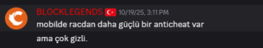

# Block Legends — Client & Network Protocol Reverse Engineering

A static reverse-engineering study of **Block Legends** (`net.blocklegends`, v218), an Android title built on a
CraftRise/Minecraft-Java derived engine. The goal was to reconstruct the client↔server protocol well enough to
document its wire format, transport, and cryptography, and to assess what actually protects the client.

Everything here is the product of static analysis of the shipped native image (`libblocklegends.so`) and the
bundled `libGameNetworkingSockets.so`, plus the Android packaging. No game binaries, decompiled sources, or assets
are redistributed — only original analysis and tooling.

---

## Background

The client-side protection of this title was publicly described by its operator as a proprietary anti-cheat
"stronger than RAC." The findings below document what the client actually ships: there is no bespoke client-side
anti-cheat module in the native image. The practical barrier to analysis is the engine's **AOT compilation**
(GraalVM native-image), which strips bytecode and symbols, combined with **mandatory transport encryption** from a
stock copy of Valve's GameNetworkingSockets. Both are off-the-shelf technologies. Server-side enforcement was not
assessed (no server access).

<p align="center"></p>

---

## TL;DR

- **Engine:** Java compiled to arm64 with **GraalVM native-image (SubstrateVM)**. The APK ships no `.dex`; the whole
  managed runtime is a single 229 MB AOT `.so`. No bytecode, no per-method symbols, indirect JNI dispatch.
- **Transport:** stock **Valve GameNetworkingSockets** over UDP. Connection-oriented, with its own SNP reliability
  layer, and **mandatory** X25519 + AES-256-GCM encryption. A passive UDP capture yields ciphertext only.
- **App framing:** none. One GNS message body equals exactly the bytes the engine wrote into the send `ByteBuffer`.
  The first field on the wire is the packet id; the rest is the payload. No outer length prefix.
- **Serializer:** a Netty-`ByteBuf`-backed `FriendlyByteBuf`/`PacketDataSerializer` equivalent, fully mapped at the
  instruction level (`writeVarInt`, `writeString`, `writeUUID`, `writeBlockPos`, …) with exact addresses.
- **Opcode:** every packet id is a **signed byte** produced by a per-descriptor `getId()` virtual and written as the
  leading `VarInt` of each packet's `write()`. It is a runtime object field, not a compile-time immediate, so the
  numeric `id ↔ class` table is built at startup and is not present in static data.
- **Status:** the transport, crypto, serializer, packet model, and opcode *mechanism* are recovered. The numeric
  opcode table and the confirmed login-packet identity require one dynamic capture on real arm64 hardware; the exact
  hook points are documented below.

Full write-ups live in [`docs/`](docs/). The protocol summary is [`docs/08_PROTOCOL_SPEC.md`](docs/08_PROTOCOL_SPEC.md).

---

## Method & tooling

- Disassembly/decompilation driven through **IDA (idalib)** against `libblocklegends.so` (imagebase 0, so file VAs
  equal the addresses cited here) and `libGameNetworkingSockets.so`.
- Multi-pass static analysis: the SubstrateVM object model and image-heap layout were reconstructed first, then used
  to pivot through metadata the linker preserves (DynamicHub names, JNI linkage records) into otherwise-anonymous AOT
  code.
- Frida hooks (in [`tools/`](tools/)) and the Android packaging/instrumentation scripts (in [`scripts/`](scripts/))
  support the runtime side once a suitable device is available.

All addresses below are verified against the IDA database. Where a finding is inferred rather than byte-proven, it is
labelled as such.

---

## Engine: GraalVM native-image (SubstrateVM)

native-image AOT-compiles the entire Java program — application plus a cut-down JVM (GC, threads, exceptions) — into a
closed-world native binary. Consequences for analysis:

- No `classes.dex`, no class/method structures to load into a Java decompiler. Method bodies are anonymous
  `sub_XXXXXX` functions.
- Class **names** survive (the runtime needs them for stack traces and reflection) inside per-class **DynamicHub**
  metadata, but method bodies carry no symbols and reach the JNI stubs only through generated indirect wrappers.
- Build-time-initialised objects are serialised into an **image heap** baked into the `.so` as data.

Reconstructed layout (verified):

| Region | Range | Role |
|---|---|---|
| `.text` | `0x386c000–0x8216928` | 77 MB AOT code |
| `.rodata` | `0x822c000–0x866a538` | C string literals (no jump tables) |
| `.svm_heap` | `0x8674000–0xdb2c000` | 88.6 MB GraalVM image heap — every DynamicHub, String/`byte[]`, build-time registry |
| `.rela.dyn` | `0x551f0–0x3816bd8` | ~2.45M `R_AARCH64_RELATIVE` relocs = the whole heap pointer graph |

**DynamicHub** (a `java.lang.Class` instance): `+0x00` meta-hub marker `0x097D3C00` (present on every hub — scan the
8-aligned qword to enumerate all classes), `+0x28` → name `String*`, `+0x30` → super-hub. **String:** `+0x08` →
`byte[]` value; **`byte[]` (Latin1):** `+0x0C` length, `+0x10` raw bytes. **Enum constant:** stride `0x28`, `+0x08`
name, `+0x10` ordinal. Heap pointer slots are stored as 0 in the file and materialised only by `.rela.dyn`.

GraalVM here is a build choice inherited from the engine's Java lineage; it is functionally analogous to Unity's
IL2CPP (managed → native AOT) seen in other mobile titles. It is not an anti-cheat.

## Transport: GameNetworkingSockets

The game statically links stock open-source **GameNetworkingSockets** (OpenSSL crypto backend), confirmed by the flat
`SteamAPI_ISteamNetworkingSockets_*` API and the OSS-only config ids. There is no custom transport. You cannot speak
it with a raw UDP socket: GNS adds its own **SNP** layer (16-bit sequence numbers, typed reliable/unreliable
segments, selective acks, per-lane reliable streams, Nagle coalescing, MTU fragmentation) and then AES-256-GCM-seals
the whole frame.

The client builds the connection with `ConnectByIPAddress(&addr, 12, pOptions)`. The 12 `SteamNetworkingConfigValue_t`
entries (built by `sub_811ADE4` @ `0x811ade4`) are:

| Config | id | value |
|---|---|---|
| IP_AllowWithoutAuth | 23 | 1 |
| Unencrypted | 34 | 0 (encryption stays on) |
| SendBufferSize | 9 | 1048576 |
| RecvBufferSize | 47 | 1048576 |
| RecvBufferMessages | 48 | 1024 |
| RecvMaxMessageSize | 49 | 524288 |
| SendRateMin | 10 | 524288 |
| SendRateMax | 11 | 2097152 |
| NagleTime | 12 | 0 |
| MTU_PacketSize | 32 | 1180 |
| TimeoutInitial | 24 | 12000 ms |
| TimeoutConnected | 25 | 15000 ms |

DNS is resolved client-side (`m2.blocklegends.net` → `81.8.66.123:26002`, parsed via
`SteamNetworkingIPAddr::ParseString`).

### Cryptography

X25519 ECDH → SHA-256/HKDF → per-direction keys and IV salts; Ed25519 for certificate/key-exchange signing; bulk
AES-256-GCM AEAD with nonce = IV-salt XOR per-packet sequence number and a 16-byte GMAC tag (a tag failure drops the
packet). `IP_AllowWithoutAuth=1` relaxes only peer *authentication* (cert checking), not confidentiality — every
application message is encrypted before it reaches the socket. Capture must therefore happen at the API boundary
(plaintext `ByteBuffer`), never on the network.

### The JNI boundary

The four native bridges are `GnsNative.send` @ `0x811fd3c` `(env, cls, connPtr, ByteBuffer, len, lane, sendFlags)`,
`sendBatch` @ `0x8120a70`, `receive` @ `0x811f534`, `connect` @ `0x811a88c`. `send` does
`GetDirectBufferAddress → AllocateMessage(len) → memcpy → SendMessages`; it adds no framing. `receive` does
`GetDirectBufferAddress → ReceiveMessagesOnConnection` then `memcpy(buf, msg->m_pData, m_cbSize)` and returns the
size. Send descriptor struct: `{+0x08 ByteBuffer, +0x10 len, +0x18 lane, +0x1C flags}`.

`xrefs_to` the bridges returns only data references — AOT calls a `native` method through a generated wrapper that
loads the resolved function pointer from a linkage slot and branches indirectly. That wall was broken by pivoting
through SubstrateVM's **JNINativeLinkage** metadata in the image heap: the linkage record for
`Lgnatives/GnsNative;.send (JLjava/nio/ByteBuffer;III)I` (heap object `0xba4cff0`) is referenced from slot
`off_8275FE8`, which is loaded by the AOT JNI wrapper `sub_3C84240`. Its two callers are the transport paths:
`sub_64DCFF0` (reliable; literal `lane=0, flags=9` = Reliable|NoNagle) and `sub_64DD1F0` (generic). One frame up is
the flush/serialize routine `sub_64D8060`.

## Serializer

The packet serializer wraps a Netty `ByteBuf` at `this+0x8` and forwards each primitive to a fixed vtable slot. The
primitive set, verified at the instruction level:

| primitive | addr | encoding |
|---|---|---|
| `writeVarInt` (32-bit) | `0x680ea30` | LEB128 (`AND #0x7F` / `ORR #0x80` / `LSR #7`) |
| `writeVarLong` (64-bit) | `0x680eb40` | LEB128 over 64-bit |
| `readVarLong` | `0x680a660` | shift-accumulate, overflow guard at 10 bytes |
| `writeString` / `writeUTF` | `0x680df60` | UTF-8 → `writeVarInt(byteLen)` → `writeBytes` (no char count) |
| `writeUUID` | `0x680a900` | two `writeLong` (obj `+0x8`, `+0x10`) |
| `writeBlockPos` | `0x680abb0` | x/y/z packed into one long, `writeLong` |
| `writeIdentifier` | `0x680e510` | stringify → `writeString` |
| `writeByteArray` | `0x680bae0` | `writeVarInt(len)` → `writeBytes` |

`ByteBuf` vtable: `writeBoolean +0x3D0`, `writeByte +0x3D8`, `writeBytes +0x3F0`, `writeDouble +0x410`,
`writeFloat +0x418`, `writeInt +0x420`, `writeLong +0x428`, `writeShort/enum +0x430`, `readByte +0x2A0`.

`writeVarInt @0x680ea30` has exactly **96 code callers** — the per-packet `write()` bodies. The ordered sequence of
primitive calls in each is that packet's field layout.

## Packet model & opcode mechanism

The protocol is a small fixed registry — `net.blocklegends.network.Packet` (base read/write),
`PacketManagerCustom` (the `id ↔ class` registry/dispatch), `PacketRequest`/`PacketResponse` (generic wrappers),
`PacketPlayOutPlayerChange` (a concrete typed packet), and `EnumConnectionState` (HANDSHAKING/STATUS/LOGIN/PLAY).
It is not a Minecraft-style large per-opcode table.

How a packet id reaches the wire (verified):

- Each packet's `write()` is a virtual method at DynamicHub slot `+0x100` (`read` = `+0x110`, factory = `+0x108`).
- The leading `writeVarInt` of each top-level `write()` emits the packet id, and its operand is **always a field
  load** `LDR Wn,[obj,#off]`, never an immediate.
- The id value is assigned at registration. `sub_765CF10` builds the registry; for each descriptor it calls
  `loc_76397F0` @ `0x76397f0`, which invokes a virtual `getId()` at **descriptor vtable slot `+0x2A8`**, range-checks
  the result with `(id + 0x80) < 0x100`, and registers it. The range check proves the opcode is a **signed byte**
  (−128..127). Registry singleton: `qword_AF979E8`.

So the wire opcode is a runtime field of each packet object, sourced from a descriptor-side `getId()`. Because the
registry is built at startup rather than baked into data, the numeric `id ↔ class` table is not statically present;
only the mechanism is. (Composed list/array sub-codecs also lead with a `VarInt`, but there it is an element count,
not an id — these are distinguished in the catalog.)

### Writer field-layout catalog (excerpt)

From the 96 `write()` bodies; identities are structural guesses pending dynamic confirmation:

| writer | wire order | candidate |
|---|---|---|
| `sub_66477D0` | varInt; string(`+0x08`); string(`+0x10`); varInt; byte | login/handshake (two optional creds) |
| `sub_76D86A0` | string; varInt(enum); string; opt varInt | login/identifier-keyed |
| `sub_6A8FEF0` | varInt; string; short; varInt; opt string×2 | chat/system message |
| `sub_5136870` | 2×varInt; switch(action){UUID,string,…} | player-info update (uses `writeUUID`) |
| `sub_5628D20` | blockPos; varInt(registry id) | block update |
| `sub_55C9530` | varInt; switch{double×; `writeVarLong`; varInt} | entity move/position |
| `sub_648E610` | varInt(entityId); varInt(enum); float×3; float | interact/use-entity |
| `sub_6BEEFB0` | varInt; byte; byteArray | custom payload / plugin message |

Full catalog: [`docs/08e_opcode_writesite_login.md`](docs/08e_opcode_writesite_login.md).

### Authentication

The session token enters the engine through `Java_net_blocklegends_natives_GNatives_onTokenReceived` @ `0x80c4bf0` →
`CallStaticVoidMethod(nativesClass = qword_DB2CF30, "onTokenReceived", "(Ljava/lang/String;Ljava/lang/String;)V",
token, str2)`. Identity originates from Google Play Games. The AOT method that receives it is reflection/JNI-registered
and async/lambda-indirected, so there is no static edge from the token to its writer; the strongest structural login
candidate is `sub_66477D0` above. `IP_AllowWithoutAuth` does not bypass application auth — the token is validated
server-side.

## What requires runtime, and how

The numeric opcode table and the confirmed login identity require one capture session on real arm64. Because the
native side adds zero framing, a hook at the boundary yields exact packet bytes:

1. `writeVarInt @0x680ea30` — log `(return address, first arg)`. The return address identifies the writer; the first
   `VarInt` of each top-level `write()` is the live packet id. This yields the `id ↔ writer` table directly.
2. `loc_76397F0 @0x76397f0` (registration) — at each call read the descriptor and observe `getId()` at
   `descriptor+0x2A8`, logging `(packet write fn at hub+0x100, signed-byte id)`. This builds the **entire** table at
   startup, before any traffic — the cleanest single hook.
3. `GnsNative.send @0x811fd3c` / `receive @0x811f534` — dump the `ByteBuffer` (`GetDirectBufferAddress`); first byte =
   opcode, rest = payload. Cross-check against the serializer layout.
4. `writeString @0x680df60` during auth — the two consecutive UTF-8 args equal to the `onTokenReceived` token pin the
   login writer and its opcode.

The corresponding native capture script is in [`tools/frida_native_capture.js`](tools/frida_native_capture.js).

## Runtime environment notes

Running the engine off-device is non-trivial. The full pipeline works (split-APK `minSdk` patch + page-align +
co-sign; PairIP handled below; EGL/GLES initialises) **except the engine itself**: the GraalVM native-image runtime
does not run under x86→arm64 binary translation. `berberis` reaches EGL then fails at `graal_create_isolate` (rc=23,
isolate heap/address-space model incompatible); `houdini` faults earlier inside `libhoudini.so`. This is
architectural. Dynamic capture needs a real arm64 device, or true full-system arm64 emulation, or a cloud arm64 host.

The Android license layer is Google **PairIP**, here Java-only (no `libpairipcore.so`). Its local check passes when
the installer package is `com.android.vending`; it is not a meaningful obstacle to analysis.

## Client-side protection — assessment

What protects the client, in practice:

- **AOT native compilation** (GraalVM native-image) — removes bytecode and symbols, which is the real reason static
  analysis is slow. This is obfuscation-by-compilation, a side effect of the build, not a detection system.
- **Mandatory transport encryption** — stock GNS with X25519/AES-256-GCM. Confidentiality cannot be disabled.
- **Stock crypto/netcode** — GameNetworkingSockets + OpenSSL, used as shipped.

No proprietary client-side anti-cheat component was identified in the native image. Whether behavioural enforcement
exists server-side is out of scope here (no server access).

## Repository layout

```
docs/      analysis reports 00–08e — start with 08_PROTOCOL_SPEC.md, then 08d/08e for the opcode work
tools/     Frida scripts (native packet capture, PairIP handling, environment helpers)
scripts/   APK patch/sign, emulator/translation flashing, Frida driver
assets/    images
```

Game binaries, decompiler output, and assets are intentionally excluded (`.gitignore`); only original analysis and
tooling are tracked.

## Disclaimer

This is interoperability and security research. The contents are reverse-engineering *findings*, not a ready-to-run
tool, and no game binaries, source, or assets are redistributed. Use within the applicable terms of service and local
law.
